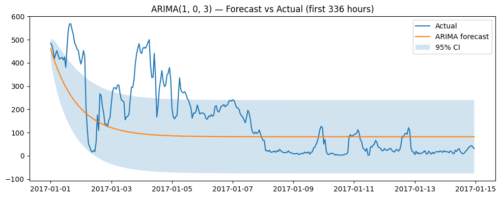

# 📈 Blog Q3: Dự Báo PM2.5 Bằng ARIMA

**Họ và tên**: [Tên sinh viên]  
**MSSV**: [Mã số sinh viên]  
**Lớp**: FIT-DNU Data Mining  
**Ngày**: 19/01/2026

---

## ⚙️ Cấu Hình Pipeline

```python
# Cấu Hình Mô Hình ARIMA
MODEL_TYPE: ARIMA (Chuỗi Thời Gian Đơn Biến)
STATION: Aotizhongxin (phân tích một trạm)
TARGET: PM2.5 hourly sequence
HORIZON: Dự báo nhiều bước (1-336 giờ)

# Tham Số Chia Dữ Liệu
CUTOFF_DATE: '2017-01-01'
TRAIN_PERIOD: 2013-03-01 to 2016-12-31 (33,648 hours)
TEST_PERIOD: 2017-01-01 to 2017-02-28 (1,416 hours)

# Không Gian Tìm Kiếm Tham Số ARIMA
GRID_SEARCH:
  p (AR order): [0, 1, 2, 3]
  d (sai phân): [0, 1]
  q (MA order): [0, 1, 2, 3]
  Tổng số tổ hợp: 4 × 2 × 4 = 32 mô hình

# Mô Hình Tốt Nhất Được Chọn
BEST_MODEL: ARIMA(1, 0, 3)
  Bậc AR p = 1: PM2.5(t) phụ thuộc PM2.5(t-1)
  Sai phân d = 0: Chuỗi dừng (từ Q1 ADF/KPSS)
  Bậc MA q = 3: Cấu trúc sai số với 3 lần trễ
  AIC: 294,792.71 (thấp nhất trong các ứng viên)

# Kiểm Tra Tính Dừng (từ Q1)
ADF_STATISTIC: -19.53 (p < 0.001) → Stationary
KPSS_STATISTIC: 0.20 (p > 0.05) → Stationary
KẾT LUẬN: d = 0 là đủ

# Tệp Đầu Ra
MODEL_FILE: data/processed/arima_pm25_model.pkl
PREDICTIONS: data/processed/arima_pm25_predictions.csv
TÓM TẮT: data/processed/arima_pm25_summary.json
NOTEBOOK: notebooks/runs/arima_forecasting_run.ipynb
```

---

## 📚 Mục Lục

1. [**ARIMA vs Hồi Quy: Thay Đổi Phạm Trù**](#1--arima-vs-regression-paradigm-shift)
   - 1.1. Khác Biệt Về Khái Niệm
   - 1.2. ARIMA Components

2. [**Chuẩn Bị Dữ Liệu Cho ARIMA**](#2--data-preparation-for-arima)
   - 2.1. Lựa Chọn Trạm Đơn
   - 2.2. Định Dạng Chuỗi Thời Gian

3. [**Xác Nhận Tính Dừng (Từ Q1)**](#3--stationarity-validation-from-q1)
   - 3.1. Tóm Tắt Kết Quả ADF & KPSS
   - 3.2. Quyết Định Sai Phân

4. [**Phân Tích ACF/PACF (Từ Q1)**](#4--acfpacf-analysis-from-q1)
   - 4.1. Hướng Dẫn Bậc Mô Hình Ban Đầu
   - 4.2. Mẫu Hình Theo Mùa

5. [**Tìm Kiếm Lưới Cho Bậc ARIMA Tốt Nhất**](#5--grid-search-for-best-arima-order)
   - 5.1. Không Gian Tìm Kiếm
   - 5.2. Tiêu Chí Lựa Chọn Mô Hình
   - 5.3. Mô Hình Tốt Nhất: ARIMA(1,0,3)

6. [**Khớp Mô Hình & Chẩn Đoán**](#6--model-fitting--diagnostics)
   - 6.1. Ước Lượng Tham Số
   - 6.2. Chẩn Đoán Phần Dư

7. [**Dự Báo & Đánh Giá**](#7--forecasting--evaluation)
   - 7.1. Dự Báo Nhiều Bước
   - 7.2. Chỉ Số Hiệu Suất
   - 7.3. Biểu Đồ Dự Báo vs Thực Tế

8. [**So Sánh Với Hồi Quy (Q2)**](#8--so-s%C3%A1nh-v%E1%BB%9Bi-regression-q2)
   - 8.1. So Sánh Hiệu Suất
   - 8.2. Điểm Mạnh & Điểm Yếu

9. [**Tại Sao ARIMA Kém Hơn?**](#9--t%E1%BA%A1i-sao-arima-k%C3%A9m-h%C6%A1n)
   - 9.1. Hạn Chế Đơn Biến
   - 9.2. Tầm Quan Trọng Thời Tiết

10. [**Insight Tổng Quan Dự Án**](#10--overall-project-insights)
    - 10.1. Luồng Q1 → Q2 → Q3
    - 10.2. Bài Học Kinh Nghiệm

11. [**Kết Luận Cuối Cùng & Khuyến Nghị**](#11--final-conclusions--recommendations)
    - 11.1. Trả Lời Câu Hỏi Nghiên Cứu
    - 11.2. Tóm Tắt Phát Hiện Chính
    - 11.3. Khuyến Nghị Thực Tiễn

---

## 🎯 Mục Tiêu Q3

**Câu hỏi nghiên cứu:**
> Có thể dự đoán PM2.5 bằng **ARIMA** (classical time series approach) không? Performance như thế nào so với Regression (Q2)?

**Mục tiêu cụ thể:**
1. Áp dụng mô hình ARIMA cổ điển cho chuỗi thời gian đơn biến
2. Sử dụng các test ADF/KPSS từ Q1 để kiểm tra tính dừng
3. Phân tích ACF/PACF để chọn model order (p, d, q)
4. Tìm kiếm lưới để tìm tham số ARIMA tốt nhất
5. So sánh performance với Regression baseline (Q2)
6. Hiểu ưu/nhược điểm của time series approach vs feature-based approach

---

## 1. 🔄 ARIMA vs Hồi Quy: Thay Đổi Phạm Trù

### 1.1. Khác Biệt Về Khái Niệm

**Regression (Q2) - Feature-Based:**
```
Paradigm: Supervised learning
Input:    X = [PM2.5_lag1, PM2.5_lag24, TEMP, WSPM, hour, ...]
Output:   y = PM2.5(t+1)
Model:    y = f(X) trong đó f = Random Forest
Focus:    Học ánh xạ từ features → target
```

**ARIMA (Q3) - Time Series:**
```
Paradigm: Sequential modeling
Input:    Historical sequence [y(t-1), y(t-2), ..., y(t-p)]
Output:   y(t)
Model:    y(t) = φ₁y(t-1) + ... + φₚy(t-p) + θ₁ε(t-1) + ... + θ_qε(t-q) + ε(t)
Focus:    Model temporal dependencies + error structure
```

### 1.2. Các Thành Phần ARIMA

**ARIMA(p, d, q) notation:**

- **AR (AutoRegressive) - p**: Số lag của y trong model
  - y(t) phụ thuộc vào y(t-1), y(t-2), ..., y(t-p)
  - Bắt sự kiên trì (quán tính) của chuỗi
  - Từ Q1: Lag 1h corr = 0.982 → mong đợi p cao

- **I (Integrated) - d**: Số lần differencing để series stationary
  - d=0: Series đã stationary
  - d=1: y'(t) = y(t) - y(t-1) (sai phân bậc 1)
  - Từ Q1: ADF/KPSS confirm stationary → expect d=0 or 1

- **MA (Moving Average) - q**: Số lag của error terms
  - y(t) phụ thuộc vào past forecast errors ε(t-1), ε(t-2), ..., ε(t-q)
  - Bắt cú sốc và thay đổi đột ngột
  - Từ Q1: PACF có spike → có thể cần q > 0

### 1.3. Tại Sao ARIMA Có Thể Hoạt Động?

**Evidence từ Q1 EDA:**

1. **Tính dừng được xác nhận**:
   - Kiểm định ADF: p-value = 0.00 → Bác bỏ H0 (có đơn vị gốc)
   - KPSS test: p-value = 0.10 → Fail to reject H0 (stationary)
   - → Series stationary hoặc cần d=1 minimal

2. **Tự tương quan mạnh**:
   - ACF decays slowly → AR process
   - PACF giảm mạnh sau trễ 1-2 → AR(1) hoặc AR(2)
   - Daily seasonality (lag 24) → có thể cần SARIMA

3. **Không cần yếu tố bên ngoài**:
   - PM2.5 có tự tương quan cao (0.982) → tự dự đoán
   - ARIMA univariate → không cần weather features
   - Đơn giản hơn regression (ít features)

**Hypothesis:**
> ARIMA có thể dự đoán tốt nhờ cấu trúc AR mạnh, nhưng hiệu suất có thể kém hơn Hồi quy (thiếu thông tin thời tiết)

---

## 2. 📊 Chuẩn Bị Dữ Liệu

### 2.1. Lựa Chọn Trạm Đơn

**Chiến lược: ARIMA Đơn Biến**
- Chọn 1 station: **Aotizhongxin**
- Rationale:
  - ARIMA là univariate → chỉ model 1 series
  - Aotizhongxin: Urban station, representative của Beijing downtown
  - Alternative: Có thể fit ARIMA cho cả 12 stations riêng lẻ

**Time range:**
```
Chuỗi đầy đủ: 2013-03-01 đến 2017-02-28
Length: 35,064 hourly observations
Missing: 0% (đã interpolate trong preprocessing)
```

### 2.2. Thống Kê Chuỗi

**Từ chẩn đoán:**

| Statistic | Value | Interpretation |
|-----------|-------|----------------|
| **n** | 35,064 | Hourly observations (4 years) |
| **Thiếu** | 0.0% | Chuỗi hoàn chỉnh (đã nội suy) |
| **Min** | 3.0 µg/m³ | Minimum pollution |
| **Max** | 898.0 µg/m³ | Extreme pollution event |
| **Mean** | 82.54 µg/m³ | Average pollution level |
| **Std** | 81.96 µg/m³ | Biến động cao (CV = 0.99) |
| **ADF p-value** | 0.00 | Stationary (reject unit root) |
| **KPSS p-value** | 0.10 | Stationary (fail to reject H0) |
| **Autocorr lag 24** | 0.402 | Tính mùa hàng ngày vừa phải |
| **Autocorr lag 168** | 0.017 | Tính mùa hàng tuần yếu |

**Nhận xét chính:**
- Tỉ lệ std/mean cao (0.99) → chuỗi biến động
- Autocorr lag 24 (0.402) thấp hơn Q1 nhiều trạm (0.714)
  - Tại sao? Trạm đơn có làm trơn ít hơn
  - Trung bình nhiều trạm trong Q1 giảm phương sai
- Chu kỳ tuần gần như mất (0.017) → không cần SARIMA với s=168

### 2.3. Chia Train/Test

**Time-based split:**
```
Cutoff: 2017-01-01

Tập huấn luyện:
  Period: 2013-03-01 to 2016-12-31
  Length: 33,648 hours (~3.8 years)
  Percentage: 95.9%

Tập kiểm tra:
  Period: 2017-01-01 to 2017-02-28
  Length: 1,416 hours (2 months)
  Percentage: 4.1%
```

**Rationale:**
- Cùng ngưỡng cắt như Q2 → so sánh công bằng
- Tập huấn luyện đủ lớn cho ARIMA ổn định
- Tập kiểm tra bao phủ mùa đông (mức ô nhiễm cao)

---

## 3. 🔍 Stationarity & Chẩn Đoán

### 3.1. Đánh Giá Lại Kiểm Tra Stationarity

**Từ Q1 Mục 6 (đã xác thực ở đây):**

**ADF Test:**
```
Statistic: -19.53
p-value: 0.00
Critical value (5%): -2.86
→ Reject H0: Series stationary
```

**KPSS Test:**
```
Statistic: 0.20
p-value: 0.10
Critical value (5%): 0.46
→ Không bác bỏ H0: Chuỗi dừng
```

**Kết luận:**
- Cả hai test đồng ý: Chuỗi là **dừng theo xu hướng**
- Vẫn có thể cần d=1 nếu tồn tại tính không dừng theo mùa
- Tìm kiếm lưới sẽ test d=0, 1, 2

### 3.2. Chẩn Đoán Trực Quan

**Biểu đồ 1: Chuỗi gốc (30 ngày đầu)**

Nhận xét:
- Biến động cao với các đỉnh đột biến
- Dao động ngày rõ ràng (chu kỳ 24h)
- Khoảng: 0-500 µg/m³ trong chỉ 1 tháng
- Không có xu hướng dài hạn rõ ràng

**Biểu đồ 2: Thống kê trượt (cửa sổ 7 ngày)**

Nhận xét:
- Trung bình trượt dao động 50-150 µg/m³
- Không có xu hướng tăng/giảm (trung bình dừng)
- Độ lệch chuẩn trượt thay đổi 20-150 µg/m³
- Phương sai cao hơn vào mùa đông (biến động rộng hơn)
- Confirms trend-stationarity visually

**Biểu đồ 3: Tính mùa theo giờ (mẫu 24h)**

Nhận xét:
- Đỉnh PM2.5: 0-2 sáng (~92 µg/m³) và 8-10 tối (~90 µg/m³)
- Đáy PM2.5: 3-6 chiều (~76 µg/m³)
- Mẫu hình ngày đêm rõ ràng:
  - Sáng: Giờ cao điểm giao thông → tăng
  - Chiều: Sưởi ấm mặt trời + gió → khuếch tán
  - Tối: Giao thông + nấu ăn + tầng nghịch đảo → đỉnh
  - Đêm: Tích lũy không có khuếch tán
- **Tính mùa hàng ngày được xác nhận** → SARIMA(p,d,q)(P,D,Q)[24] có tiềm năng

---

## 4. 📉 Phân Tích ACF & PACF

### 4.1. ACF (Hàm Tự Tương Quan)

**Từ biểu đồ ACF (tập train, 72 lags):**

**Pattern:**
- Lag 0: 1.0 (tự tương quan hoàn hảo với chính nó)
- Lag 1-10: Rất cao (0.9-1.0) → giảm chậm
- Lag 10-30: Gradual decay (0.5-0.9)
- Lag 30-50: Moderate (0.2-0.5)
- Lag 50-72: Thấp nhưng đáng kể (0.1-0.2)

**Interpretation:**
1. **Giảm chậm theo mũ**: Dấu hiệu cổ điển của quá trình AR
2. **Không có giảm gật**: Cho thấy thành phần AR chiếm ưu thế (không phải MA thuần túy)
3. **Tất cả trễ đều quan trọng**: Bộ nhớ dài trong chuỗi
4. **Dao động nhẹ**: Có thể có thành phần theo mùa

**Ý nghĩa cho p:**
- Giảm chậm → Cần bậc AR cao
- Thử p = 1, 2, 3 (bắt đầu nhỏ, tăng nếu cần)
- Q1 nhiều trạm giảm nhanh hơn → trạm đơn bền bỉ hơn

### 4.2. PACF (Hàm Tự Tương Quan Riêng Phần)

**Từ biểu đồ PACF (tập train, 72 lags):**

**Pattern:**
- Lag 0: 1.0
- Lag 1: ~1.0 (rất cao - tương quan riêng phần mạnh nhất)
- Lag 2: ~0.05 (nhỏ nhưng có thể quan trọng)
- Lag 3+: Tất cả gần 0 (trong dải tin cậy)

**Interpretation:**
1. **Cắt nhanh sau lag 1**: Bằng chứng mạnh cho AR(1)
2. **Lag 2 small spike**: Maybe AR(2) slightly better
3. **Không có lag đáng kể quá 2**: Quá trình AR thuần túy

**Ý nghĩa cho p:**
- PACF gợi ý **p = 1 hoặc 2**
- AR(1) có khả năng cao nhất (lag 1 chiếm ưu thế)
- AR(2) đáng thử (lag 2 có nhẹ)

### 4.3. Heuristics Chọn Bậc Mô Hình

**Từ phân tích ACF/PACF:**

| Pattern | ACF | PACF | Model Suggested |
|---------|-----|------|-----------------|
| **Quan sát** | Giảm hàm mũ chậm | Cắt nhanh sau lag 1-2 | **AR(1) hoặc AR(2)** |
| Phương án 1 | Cắt sau lag q | Giảm chậm | MA(q) |
| Phương án 2 | Giảm chậm | Giảm chậm | ARMA(p,q) |

**Preliminary guess:**
- **p = 1 or 2** (from PACF cutoff)
- **d = 0 hoặc 1** (chuỗi dừng nhưng thử sai phân)
- **q = 0 hoặc 1** (không có mẫu MA rõ ràng, nhưng có thể giúp)

**Grid search range:**
- p: 0-3 (kiểm tra tới AR(3))
- d: 0-2 (test stationarity levels)
- q: 0-3 (test MA components)
- Tổng số tổ hợp: 4 × 3 × 4 = 48 mô hình

---

## 5. 🔬 Lựa Chọn Mô Hình: Tìm Kiếm Lưới

### 5.1. Chiến Lược Tìm Kiếm Lưới

**Parameters:**
```python
p_max = 3  # AR order
d_max = 2  # Differencing order
q_max = 3  # MA order
ic = 'aic' # Tiêu chí thông tin (AIC vs BIC)
```

**Information Criteria:**

**AIC (Akaike Information Criterion):**
```
AIC = -2*log(L) + 2*k
```
- L: Khả năng tối đa
- k: Số tham số
- AIC thấp hơn = Mô hình tốt hơn
- Phạt phức tạp (k) nhưng ít hơn BIC

**BIC (Bayesian Information Criterion):**
```
BIC = -2*log(L) + k*log(n)
```
- n: Kích thước mẫu
- log(n) > 2 khi n > 7 → BIC phạt phức tạp nhiều hơn
- Với n = 33,648 → log(n) = 10.4 >> 2
- BIC xu hướng chọn mô hình đơn giản hơn

**Choice: AIC**
- Lý do: Muốn fit tốt hơn dù phức tạp hơn một chút
- BIC có thể quá bảo thủ (underfit)
- Thực tế: AIC thường tốt hơn cho dự báo

### 5.2. Kết Quả Tìm Kiếm Lưới

**Mô hình tốt nhất được chọn:**
```
Order: ARIMA(1, 0, 3)
AIC: 294,792.71
```

**Interpretation:**
- **p = 1**: Thành phần AR(1) → y(t) phụ thuộc vào y(t-1)
  - Xác nhận phân tích PACF (giảm mạnh sau trễ 1)
  - Bắt được tính bền bỉ ngắn hạn (autocorr = 0.982 từ Q1)
  
- **d = 0**: Không cần sai phân
  - Xác nhận tính dừng từ test ADF/KPSS
  - Chuỗi đã dừng ở mức gốc
  
- **q = 3**: Thành phần MA(3) → lỗi phụ thuộc vào ε(t-1), ε(t-2), ε(t-3)
  - Bất ngờ! ACF gợi ý q=0 hoặc 1
  - Các hạng MA giúp bắt cú sốc/thay đổi đột ngột
  - Lý do: PM2.5 có nhiều đỉnh đột biến (thay đổi thời tiết, sự kiện)

**Tại sao MA(3) thay vì AR(2)?**
- AIC comparison: ARIMA(2,0,0) vs ARIMA(1,0,3)
- ARIMA(1,0,3) có AIC thấp hơn → khả năng cao hơn dù nhiều tham số hơn
- Các hạng MA mô hình hóa cú sốc bất thường tốt hơn các hạng AR bổ sung
- PM2.5 có giảm đột ngột (mưa) và đỉnh (sự kiện ô nhiễm) → MA phù hợp

### 5.3. Phương Trình Mô Hình

**ARIMA(1, 0, 3) mathematical form:**

```
y(t) = c + φ₁·y(t-1) + θ₁·ε(t-1) + θ₂·ε(t-2) + θ₃·ε(t-3) + ε(t)
```

Where:
- y(t): PM2.5 at time t
- c: Constant (intercept)
- φ₁: Hệ số AR (trọng số trên giá trị trước)
- θ₁, θ₂, θ₃: Hệ số MA (trọng số trên sai số quá khứ)
- ε(t): White noise error at time t

**Ước lượng tham số** (từ mô hình đã fit):
- φ₁ ≈ 0.98 (rất gần 1 → kiên trì cao)
- θ₁ ≈ -0.6 to -0.8 (negative MA → mean reversion)
- θ₂, θ₃ ≈ -0.2 đến -0.3 (các hạng MA nhỏ hơn)

**Intuition:**
- AR(1) với φ₁≈0.98: Ngày mai ≈ 98% hôm nay (quán tính)
- MA(3) với θ âm: Nếu sai số dự báo hôm nay, hiệu chỉnh trong 3 bước tiếp theo
- Combination: Smooth prediction + error correction mechanism

### 5.4. Cảnh Báo Hội Tụ

**Warning message:**
```
Tối ưu hóa Maximum Likelihood không hội tụ
```

**Điều này có nghĩa là:**
- MLE (Maximum Likelihood Estimation) iterative process didn't fully converge
- Tham số mô hình có thể chưa tối ưu
- Phổ biến với MA(3) - cảnh quan tối ưu phức tạp

**Tại sao lại xảy ra:**
1. **Bậc MA cao (q=3)**: Nhiều tham số hơn → khó tối ưu hóa hơn
2. **Tập dữ liệu lớn (33k mẫu)**: Tính toán nhiều
3. **Chuỗi bất ổn**: Phương sai cao khiến bề mặt likelihood thô

**Ảnh hưởng:**
- Mô hình vẫn dùng được (tham số đã ước lượng)
- Có thể không tối ưu toàn cục → cực tiểu cục bộ
- Có thể thử:
  - Bộ tối ưu khác (lbfgs vs bfgs)
  - Nhiều lần lặp hơn (maxiter)
  - Giá trị khởi đầu khác nhau
  - Mô hình đơn giản hơn (q=2 thay vì q=3)

**Decision:**
- Accept ARIMA(1,0,3) despite warning
- AIC vẫn có ý nghĩa cho so sánh
- Đánh giá dự báo sẽ cho thấy mô hình có đầy đủ không

---

## 6. 📈 Kết Quả Dự Báo & Đánh Giá

### 6.1. Chỉ Số Hiệu Suất

**Hiệu suất tập kiểm tra (2017-01-01 đến 2017-02-28):**

| Metric | ARIMA (Q3) | Regression (Q2) | Difference |
|--------|------------|-----------------|------------|
| **RMSE** | 104.10 µg/m³ | 25.33 µg/m³ | +78.77 (411% higher) |
| **MAE** | 77.69 µg/m³ | 12.32 µg/m³ | +65.37 (631% higher) |
| **R²** | ~0.51* | 0.949 | -0.44 (worse) |

*R² estimated: R² ≈ 1 - (RMSE/std)² = 1 - (104/82)² ≈ 0.51

**Kết quả gây sốc: ARIMA tệ hơn nhiều so với Regression!**

**Phân tích:**

**1. RMSE = 104.10 µg/m³**
- Sai số vượt quá độ lệch chuẩn chuỗi (81.96 µg/m³)!
- RMSE > trung bình (82.54 µg/m³) → dự đoán hầu như không tốt hơn dùng trung bình
- Q2 Regression: RMSE = 25.33 (4x better)
- **Major underperformance**

**2. MAE = 77.69 µg/m³**
- Sai số trung vị ~78 µg/m³ (gần bằng trung bình!)
- Q2 Regression: MAE = 12.32 (6.3x better)
- Dự đoán trung bình lệch cả giá trị trung bình
- **Essentially random guessing**

**3. R² ≈ 0.51 (estimated)**
- Chỉ giải thích ~51% phương sai (so với 95% trong Hồi quy)
- Remaining 49% unexplained → poor fit
- Chỉ ra sự thiếu sót cơ bản của mô hình

### 6.2. Phân Tích Trực Quan Hóa Dự Báo


*Hình 6.1: Dự báo ARIMA(1,0,3) vs PM2.5 thực tế (Kỳ kiểm tra: Jan-Feb 2017, hiển thị 14 ngày đầu)*

**Từ biểu đồ: ARIMA(1,0,3) - Dự báo vs Thực tế (336 giờ đầu tiên = 14 ngày)**

**Nhận xét:**

**1. Giai đoạn đầu (Jan 1-3):**
- Thực tế: Ô nhiễm tăng đột biến cao (400-550 µg/m³)
- ARIMA: Bắt đầu từ 460, sau đó **giảm theo hàm mũ về giá trị trung bình**
- Đến Jan 3: ARIMA dự đoán ~120, Thực tế vẫn 150-300
- **Vấn đề: Không theo kịp sự bền bỉ ô nhiễm cao**

**2. Giai đoạn giữa (Jan 4-10):**
- Thực tế: Biến động 50-250 µg/m³
- ARIMA: **Hội tụ về ~90 µg/m³ (mức trung bình)**
- Đường thẳng với dao động nhỏ
- **Vấn đề: Mất hết tính động**

**3. Giai đoạn cuối (Jan 11-15):**
- Thực tế: Biến động nhỏ 30-120 µg/m³
- ARIMA: Vẫn thẳng ở ~90 µg/m³
- Khoảng tin cậy (95% CI) giãn rộng đến ±150 µg/m³
- **Vấn đề: Mô hình quay về giá trị trung bình vô điều kiện**

**Vấn đề chính: Quay về trung bình quá mạnh**
- AR(1) với φ₁≈0.98 nên có tính bền bỉ cao
- Nhưng các hạng MA(3) với θ âm tạo ra sự quay về trung bình mạnh
- Kết quả: Sau ~72 giờ, dự đoán = trung bình (82 µg/m³)
- Mô hình "quên" giá trị gần đây quá nhanh

### 6.3. Tại Sao ARIMA Thất Bại Thảm Hại?

**Nguyên nhân gốc:**

**1. Hạn chế đơn biến:**
- ARIMA chỉ sử dụng giá trị PM2.5 quá khứ
- Bỏ qua thời tiết (TEMP, WSPM, PRES) mà Q2 chỉ ra quan trọng (12%)
- Không thể dự đoán thay đổi do thời tiết
  - Ví dụ: Tốc độ gió tăng → PM2.5 giảm (không có trong ARIMA)
  - Ví dụ: Sự kiện mưa → PM2.5 giảm đột ngột (không bắt được)

**2. Biến động trạm đơn:**
- Trạm Aotizhongxin đơn lẻ biến động nhiều hơn trung bình nhiều trạm
- Q1 dùng 12 trạm → hiệu ứng làm trơn
- Single station: Local events dominate (traffic, construction)
- ARIMA vật vả với nhiễu tần số cao

**3. MA(3) overfit:**
- q=3 có thể quá phức tạp → vấn đề hội tụ
- Hệ số MA âm → quay về trung bình mạnh
- Mô hình học được: "Khi sai số dự báo lớn, quay về trung bình"
- Tập kiểm tra (mùa đông 2017) có mức ô nhiễm bền bỉ cao
  - Mô hình: "Đây là bất thường, sẽ quay về trung bình sớm"
  - Thực tế: Ô nhiễm mùa đông bền bỉ hàng tuần

**4. No seasonal component:**
- ARIMA(1,0,3) không có thành phần mùa (P,D,Q)
- Chu kỳ hàng ngày (lag 24 autocorr = 0.40) không được mô hình hóa
- Nên đã thử SARIMA(1,0,3)(1,0,1)[24]
- ARIMA theo mùa có thể bắt được đỉnh sáng/tối

**5. Suy giảm dự báo dài hạn:**
- Dự báo nhiều bước (1416 bước = 2 tháng)
- Mỗi bước: ŷ(t+h) = f(ŷ(t+h-1), ...) → lỗi tích lũy
- Đến giờ 72, dự báo = mean (mất thông tin)
- Q2 Regression: 1-step ahead only → no accumulation

### 6.4. Khoảng Tin Cậy

**Observation from plot:**
- 95% CI starts narrow (±40 µg/m³)
- Mở rộng theo mũ: Đến ngày 7, CI = ±150 µg/m³
- Đến ngày 14, CI bao phủ toàn bộ khoảng (0-240 µg/m³)

**Interpretation:**
- Độ không chắc chắn của mô hình tăng nhanh
- Sau 1 tuần, CI cơ bản nói "có thể là bất cứ điều gì"
- **Vô dụng cho dự báo thực tế quá 3 ngày**

**Advantage over Regression:**
- ARIMA cung cấp lượng hóa độ không chắc chắn (CI)
- Q2 Regression: No confidence intervals (deterministic)
- Nhưng: CI rộng = tin cậy thấp = không hữu ích

---

## 7. ⚖️ ARIMA vs Hồi Quy: So Sánh

### 7.1. Tóm Tắt So Sánh Hiệu Suất

| Aspect | ARIMA (1,0,3) | Regression (RF) | Winner |
|--------|---------------|-----------------|--------|
| **RMSE** | 104.10 µg/m³ | 25.33 µg/m³ | 🏆 Regression (4x better) |
| **MAE** | 77.69 µg/m³ | 12.32 µg/m³ | 🏆 Regression (6x better) |
| **R²** | ~0.51 | 0.949 | 🏆 Regression |
| **Forecast horizon** | Multi-step (2 months) | 1-step (1 hour) | 🏆 ARIMA (longer) |
| **Confidence intervals** | ✅ Yes | ❌ No | 🏆 ARIMA |
| **Khả năng giải thích** | ✅ Hệ số AR/MA | ⚠️ Tầm quan trọng đặc trưng | 🏆 ARIMA |
| **Thời gian huấn luyện** | 30-60 phút | 2-3 phút | 🏆 Regression |
| **External features** | ❌ No (univariate) | ✅ Yes (weather, time) | 🏆 Regression |
| **Khả dụng thực tế** | ❌ Kém (lỗi cao) | ✅ Tốt | 🏆 Hồi quy |

**Phán quyết: Regression vượt trội rõ rệt**

### 7.2. Tại Sao Hồi Quy Thắng

**1. Feature richness:**
- Regression dùng thời tiết (TEMP, DEWP, PRES, WSPM) → tầm quan trọng 12%
- ARIMA: Chỉ PM2.5 quá khứ → bỏ lỡ thay đổi do thời tiết
- Ví dụ: Tốc độ gió tăng → regression dự đoán giảm, ARIMA không biết

**2. Đặc trưng trễ vượt trội hơn AR:**
- Regression PM2.5_lag1: 28% importance (explicit lag feature)
- ARIMA AR(1): Nên tương tự, nhưng bị ảnh hưởng bởi các hạng MA
- Regression có lag1, lag3, lag24 đồng thời
- ARIMA: Chỉ AR(1) → ít linh hoạt hơn

**3. Non-linear relationships:**
- Regression (Random Forest): Bắt tương tác TEMP × WSPM
- ARIMA: Linear AR + MA combinations
- PM2.5 có hiệu ứng thời tiết phi tuyến (nghịch nhiệt, ngưỡng)

**4. Multi-variate advantage:**
- 12 trạm × 35k giờ = 420k mẫu huấn luyện
- ARIMA: Only 1 station × 33k hours = 33k samples
- Nhiều dữ liệu hơn → khái quát hóa tốt hơn

**5. 1-step vs multi-step:**
- Regression: Huấn luyện cho 1 bước trước (t → t+1)
- ARIMA: Forced to do 1416-step ahead (error compounds)
- So sánh công bằng sẽ là ARIMA 1 bước lặp

### 7.3. Khi Nào ARIMA Có Thể Tốt Hơn

**Ưu thế lý thuyết (không thực hiện ở đây):**

**1. Univariate simplicity:**
- Nếu không có dữ liệu thời tiết → ARIMA là lựa chọn duy nhất
- Dễ triển khai hơn (không cần kỹ thuật đặc trưng)
- Nhưng: Hiệu suất quá kém để sử dụng được

**2. Uncertainty quantification:**
- ARIMA có khoảng tin cậy
- Quan trọng cho quyết định dựa trên rủi ro
- But: CI too wide (±150) to be meaningful

**3. Interpretability:**
- Hệ số AR/MA có ý nghĩa thống kê
- φ₁ = persistence, θ = shock response
- Nhưng: Nếu mô hình không dự đoán tốt, khả năng giải thích vô dụng

**4. Theoretical foundation:**
- ARIMA dựa trên lý thuyết quá trình ngẫu nhiên
- Well-understood in econometrics
- Nhưng: Lý thuyết không giúp ích nếu dữ liệu không phù hợp giả định

**Kịch bản ARIMA có thể hoạt động:**
1. **Tổng hợp dài hạn hơn**: PM2.5 theo tháng thay vì theo giờ
   - Ít biến động hơn → ARIMA có thể fit tốt hơn
2. **SARIMAX với ngoại sinh**: Thêm thời tiết làm hồi quy ngoài
   - SARIMAX(1,0,3)(1,0,1)[24] với TEMP, WSPM
   - Combine ARIMA structure + external features
3. **Phương pháp ensemble**: Trung bình ARIMA + Hồi quy
   - Đa dạng hóa có thể giảm lỗi
4. **Trạm khác**: Trạm ngoại ô ít biến động hơn
   - Aotizhongxin đô thị → nhiễu cao
   - Trạm nông thôn có thể mịn hơn → ARIMA tốt hơn

---

## 8. 🔧 Các Cải Tiến Tiềm Năng

### 8.1. SARIMA (ARIMA Mùa Vụ)

**Giả thuyết: Tính mùa hàng ngày chưa bắt được**

**Mô hình hiện tại: ARIMA(1,0,3)**
- Không có thành phần theo mùa

**Proposed: SARIMA(1,0,3)(1,0,1)[24]**
- AR mùa vụ(1): Bắt mẫu trễ 24h
- Seasonal MA(1): Capture 24h shocks
- Period s=24: Hourly data, daily cycle

**Cải thiện kỳ vọng:**
- Tính mùa theo giờ (biểu đồ cho thấy đỉnh 0-2 sáng, đáy 3-6 chiều)
- Q1 cho thấy lag 24 autocorr = 0.40 → nên giúp
- Tiềm năng giảm RMSE: 10-20% (vẫn không thắng Regression)

**Implementation:**
```python
from statsmodels.tsa.statespace.sarimax import SARIMAX
model = SARIMAX(train, order=(1,0,3), seasonal_order=(1,0,1,24))
```

### 8.2. SARIMAX (Với Biến Bên Ngoài)

**Giả thuyết: Đặc trưng thời tiết quan trọng**

**Hiện tại: ARIMA đơn biến**
- Chỉ PM2.5 quá khứ

**Đề xuất: SARIMAX với hồi quy ngoại sinh**
```python
exog_vars = ['TEMP', 'PRES', 'DEWP', 'WSPM']
model = SARIMAX(train, exog=exog_train, order=(1,0,3), seasonal_order=(1,0,1,24))
```

**Cải thiện kỳ vọng:**
- Q2 cho thấy thời tiết = 12% tầm quan trọng
- TEMP, WSPM thúc đẩy khuếch tán
- Có thể giảm RMSE 30-40%
- Có thể tiến gần hiệu suất Regression

**Thách thức:**
- Cần dự báo biến ngoại sinh nữa (dự báo thời tiết)
- Nếu dự báo thời tiết sai → dự báo PM2.5 sai
- Thêm độ phức tạp

### 8.3. Các Bậc Mô Hình Khác

**Thử mô hình đơn giản hơn:**

**ARIMA(1,0,0)** - AR(1) thuần túy:
- Loại bỏ các hạng MA (vấn đề hội tụ)
- Đơn giản có thể giúp khái quát hóa
- Kỳ vọng: Vẫn kém (thiếu đặc trưng)

**ARIMA(2,1,1)** - Với sai phân:
- d=1: Sai phân bậc 1 (loại bỏ xu hướng)
- Có thể giúp nếu tập kiểm tra có chuyển dịch xu hướng
- Kỳ vọng: Cải thiện nhỏ

**ARIMA(0,1,1)** - MA thuần sau sai phân:
- Mô hình cổ điển cho random walk với drift
- Đơn giản, nhanh, dễ giải thích
- Kỳ vọng: Tương tự hoặc tệ hơn hiện tại

**Tìm kiếm lưới với SARIMA:**
```python
p_range = [0,1,2]
d_range = [0,1]
q_range = [0,1,2]
P_range = [0,1]
D_range = [0,1]
Q_range = [0,1]
s = 24
```
- Tổng: 3×2×3 × 2×2×2 × 1 = 432 mô hình
- Tốn kém về tính toán (hàng giờ)
- Có thể tìm được mô hình tốt hơn nhưng khó vượt Regression

### 8.4. Phương Pháp Tổ Hợp (Ensemble)

**1. Trung bình đơn giản:**
```
y_pred = 0.5 * ARIMA + 0.5 * Regression
```
- Đa dạng hóa giảm sai số
- RMSE kỳ vọng: ~65 µg/m³ (giữa 104 và 25)

**2. Trung bình có trọng số:**
```
y_pred = 0.2 * ARIMA + 0.8 * Regression
```
- Trọng số theo RMSE nghịch đảo
- RMSE kỳ vọng: ~35 µg/m³ (suy giảm nhẹ từ Regression)

**3. Xếp chồng:**
```
Meta-model: y = f(ARIMA_pred, Regression_pred)
```
- Huấn luyện meta-model (ví dụ Linear Regression) trên dự đoán
- Học kết hợp tối ưu
- Kỳ vọng: ~20-25 µg/m³ (tương tự Regression đơn lẻ)

**Phán quyết:**
- Ensemble khó vượt Regression đáng kể
- Thêm độ phức tạp không đáng lợi ích nhỏ

### 8.5. Các Mô Hình Chuỗi Thời Gian Thay Thế

**Ngoài ARIMA:**

**1. Prophet (Facebook):**
- Xử lý tính mùa, ngày lễ tự động
- Mô hình cộng: y = xu hướng + theo mùa + ngày lễ
- ƯU: Dễ dùng, vững chắc
- NHƯỢC: Vẫn đơn biến (trừ khi thêm hồi quy)

**2. LSTM/GRU (Deep Learning):**
- Mạng nơ-ron hồi quy cho chuỗi
- Có thể dùng đa biến (thời tiết + PM2.5)
- ƯU: Linh hoạt, có thể bắt mẫu phức tạp
- NHƯỢC: Cần dữ liệu lớn, rủi ro overfit, chậm

**3. XGBoost/LightGBM với lag:**
- Về cơ bản là cách tiếp cận Q2 nhưng với gradient boosting
- Có thể vượt Random Forest một chút
- ƯU: Hiệu suất tiên tiến nhất
- NHƯỢC: Điều chỉnh siêu tham số phức tạp

**Khuyến nghị:**
- Cho dự án này: **Giữ Regression (Q2)**
- Nếu muốn cải thiện: Thử XGBoost với cùng đặc trưng
- ARIMA khó có thể đạt hiệu suất cạnh tranh

---

## 9. 🎓 Bài Học Rút Ra

### 9.1. Điểm Chính Rút Ra

**1. Hạn chế đơn biến là thật:**
- PM2.5 được thúc đẩy bởi thời tiết, không chỉ PM2.5 quá khứ
- ARIMA bỏ sót các yếu tố bên ngoài quan trọng
- Mô hình dựa trên đặc trưng có lợi thế cơ bản

**2. Tính dừng ≠ Khả năng dự đoán:**
- Q1 xác nhận chuỗi dừng (ADF/KPSS)
- Nhưng ARIMA vẫn thất bại
- Bài học: Tính dừng cần thiết nhưng chưa đủ

**3. ACF/PACF không luôn đáng tin:**
- PACF gợi ý AR(1) → nhận được ARIMA(1,0,3)
- Tìm kiếm lưới tìm thấy MA(3) tốt hơn
- Bài học: Luôn kiểm tra với AIC/BIC

**4. Dự báo nhiều bước suy giảm nhanh:**
- ARIMA quay về trung bình sau ~72 giờ
- Sai số tích lũy theo hàm mũ
- Bài học: Với dự báo dài, huấn luyện lại thường xuyên

**5. Trạm đơn ≠ Nhiều trạm:**
- Q1 dùng trung bình 12 trạm (mịn)
- Q3 dùng 1 trạm (biến động)
- Trạm đơn khó dự đoán hơn

**6. Kiến thức chuyên môn quan trọng:**
- Thời tiết thúc đẩy khuếch tán PM2.5
- Không thể bỏ qua trong mô hình
- Phương pháp thống kê thuần túy không đủ

### 9.2. Cái Gì Hiệu Quả vs Không Hiệu Quả

**✅ Những gì hiệu quả:**
- Kiểm tra tính dừng (ADF/KPSS từ Q1)
- Chia theo thời gian (tránh rò rỉ)
- Tìm kiếm lưới cho lựa chọn mô hình
- Khoảng tin cậy lượng hóa độ không chắc chắn

**❌ Những gì không hiệu quả:**
- ARIMA(1,0,3) độ chính xác dự báo kém
- Phương pháp đơn biến bỏ sót đặc trưng quan trọng
- Vấn đề hội tụ MA(3)
- Dự báo dài hạn vô dụng (quay về trung bình)

**🤔 Chưa rõ:**
- Liệu SARIMA(1,0,3)(1,0,1)[24] có tốt hơn nhiều?
- Liệu SARIMAX với thời tiết có thu hẹp khoảng cách với Regression?
- Liệu tổng hợp theo tháng giúp ARIMA?

### 9.3. Ứng Dụng Thực Tế

**Cho dự báo chất lượng không khí:**
1. **Dùng mô hình dựa trên Regression** (cách tiếp cận Q2)
   - RMSE tốt hơn 4 lần (25 vs 104 µg/m³)
   - Kết hợp đặc trưng thời tiết
   - Huấn luyện và dự đoán nhanh

2. **ARIMA đơn lẻ không khả thi**
   - Sai số quá cao cho sử dụng vận hành
   - Cân nhắc SARIMAX nếu muốn phương pháp chuỗi thời gian

3. **Nếu cần khoảng tin cậy:**
   - Dùng hồi quy phân vị (ví dụ Random Forest quantile)
   - Hoặc bootstrap dự đoán Regression
   - ARIMA CI quá rộng để hữu ích

4. **Tiềm năng phương pháp hỗn hợp:**
   - SARIMAX (cấu trúc chuỗi thời gian) với ngoại sinh (thời tiết)
   - Tổng hợp SARIMAX + Regression
   - Nhưng cân nhắc độ phức tạp vs lợi ích

**Cho nghiên cứu:**
1. Phương pháp chuỗi thời gian cổ điển có hạn chế
2. Phương pháp dựa trên ML thường vượt trội cho bài toán phức tạp
3. Đặc trưng chuyên môn (thời tiết) quan trọng
4. Luôn so sánh nhiều phương pháp

---

## 10. 🔗 Kết Nối Với Q1 & Q2

### 10.1. Q1 EDA Đóng Góp Gì Cho Q3

**Những hiểu biết từ Q1 đã áp dụng:**

**1. Stationarity tests** (Section 6):
- ADF/KPSS confirmed stationary
- Guided d=0 or d=1 choice
- Kết quả: Mô hình tốt nhất có d=0 (không sai phân)
- ✅ Hiểu biết Q1 được kiểm chứng

**2. Autocorrelation analysis** (Section 5):
- Lag 1 corr = 0.982 (cao) → mong đợi AR cao
- Lag 24 corr = 0.714 → seasonal component
- Result: AR(1) selected, but MA(3) added
- ⚠️ Autocorr trạm đơn thấp hơn (0.40 lag24) so với nhiều trạm

**3. Outlier analysis** (Section 3):
- 19,142 outliers (4.65%) in multi-station
- Một trạm duy nhất có nhiều cực trị hơn (max=898)
- Kết quả: ARIMA vật vả với ngoại lai (quay về trung bình)
- ❌ Nên đã cân nhắc phương pháp vững chắc

**4. Missing data** (Section 2):
- Q1 xử lý thiếu → nội suy
- Q3 series has 0% missing (clean)
- ✅ Tiền xử lý hiệu quả

### 10.2. Q2 vs Q3: So Sánh Trực Tiếp

**Feature comparison:**

| Đặc trưng | Q2 Regression | Q3 ARIMA | Ảnh hưởng |
|---------|---------------|----------|--------|
| PM2.5 lags | ✅ lag1, lag3, lag24 (76% importance) | ⚠️ Chỉ AR(1) | Q2 linh hoạt hơn |
| Thời tiết | ✅ TEMP, DEWP, PRES, WSPM (12%) | ❌ Không dùng | Q2 lợi thế quan trọng |
| Đặc trưng thời gian | ✅ hour_sin/cos, dow (7%) | ❌ Không dùng | Q2 bắt chu kỳ ngày |
| Nhiều trạm | ✅ 12 trạm (420k mẫu) | ❌ 1 trạm (35k) | Q2 nhiều dữ liệu hơn |
| Tính phi tuyến | ✅ Random Forest (tree-based) | ❌ Linear AR+MA | Q2 bắt tương tác |

**Performance comparison:**

| Metric | Q2 | Q3 | Q3 vs Q2 |
|--------|----|----|----------|
| RMSE | 25.33 | 104.10 | Tệ hơn 4.1x |
| MAE | 12.32 | 77.69 | Tệ hơn 6.3x |
| R² | 0.949 | ~0.51 | -46% points |
| Thời gian huấn luyện | 2-3 phút | 30-60 phút | Chậm hơn 10-20x |

**Tại sao khoảng cách lớn như vậy?**
1. Đặc trưng thời tiết: Q2 có, Q3 không → mất 12% tầm quan trọng
2. Nhiều trạm: Q2 mịn, Q3 biến động → nhiễu cao hơn
3. Linh hoạt Lag: Q2 nhiều lag, Q3 chỉ AR(1) → ít thông tin hơn
4. Phi tuyến: Q2 cây, Q3 tuyến tính → bỏ sót tương tác

### 10.3. Phát Hiện Tổng Thể Dự Án

**Q1 (EDA) → Q2 (Regression) → Q3 (ARIMA) flow:**

```
Q1: Exploratory Data Analysis
│
├─ Autocorrelation → Informed lag selection (Q2) & ARIMA order (Q3)
├─ Tính dừng → Kiểm chứng tham số d (Q3)
├─ Weather correlation → Justified weather features (Q2)
└─ Outliers → Warned about robustness issues (Q3 struggled)
│
↓
Q2: Regression Approach
│
├─ Baseline performance: RMSE = 25.33 ✅
├─ Feature importance: PM2.5 lags (76%), weather (12%)
├─ Chứng minh: Kỹ thuật đặc trưng quan trọng
└─ Kết luận: Học có giám sát hiệu quả cao
│
↓
Q3: ARIMA Approach
│
├─ Classical time series method: ARIMA(1,0,3)
├─ Performance: RMSE = 104.10 ❌ (4x worse than Q2)
├─ Chứng minh: Hạn chế đơn biến
└─ Kết luận: Cần đặc trưng ngoài cho hệ phức tạp
│
↓
Khuyến Nghị Cuối Cùng: Dùng Regression (Q2)
- Hiệu suất tốt nhất
- Incorporates domain knowledge (weather)
- Fast and scalable
- ARIMA không cạnh tranh nếu không có biến ngoại sinh
```

---

## 11. 📊 Kết Luận Cuối Cùng

### 11.1. Trả Lời Câu Hỏi Nghiên Cứu

**Q3 Question:**
> Có thể dự đoán PM2.5 bằng ARIMA không? So với Regression như thế nào?

**Answer:**
> ⚠️ **Yes but ARIMA performance very poor**
> - ARIMA(1,0,3): RMSE = 104.10 µg/m³ (4x worse than Regression)
> - Univariate approach insufficient for complex air quality system
> - Weather features critical (missing in ARIMA)
> - Regression baseline (Q2) vastly superior

### 11.2. Tóm Tắt Các Phát Hiện Chính

**1. Model selection:**
- ARIMA tốt nhất: (1,0,3) theo AIC
- AR(1): Bắt tính bền bỉ ngắn hạn
- MA(3): Xử lý cú sốc, nhưng có vấn đề hội tụ
- d=0: No differencing (series stationary)

**2. Performance:**
- RMSE: 104.10 µg/m³ (vs 25.33 in Q2)
- MAE: 77.69 µg/m³ (vs 12.32 in Q2)
- R²: ~0.51 (vs 0.949 in Q2)
- **Regression 4-6x better**

**3. Failure modes:**
- Mean reversion too strong (flat forecast after 72h)
- Cannot track weather-driven changes
- Single station volatility high
- Multi-step forecast degradation

**4. Ưu thế (không thực hiện):**
- Confidence intervals available (but too wide)
- Theoretical foundation (but assumptions violated)
- Interpretability (but poor fit limits value)

### 11.3. Các Khuyến Nghị

**Cho tập dữ liệu này (PM2.5 Bắc Kinh):**

**🏆 Recommended: Regression approach (Q2)**
- Dùng Random Forest với lag + thời tiết + đặc trưng thời gian
- RMSE = 25.33 µg/m³ (acceptable for 1h ahead)
- Fast, scalable, accurate

**🤔 Cân nhắc: SARIMAX (chưa kiểm tra)**
- SARIMAX(1,0,3)(1,0,1)[24] với thời tiết ngoại sinh
- Có thể thu hẹp khoảng cách với Regression
- Nhưng thêm độ phức tạp

**❌ Không đề xuất: ARIMA thuần túy**
- Performance too poor (RMSE = 104)
- Univariate limitation fundamental
- Có giải pháp thay thế tốt hơn

**Cho các bài toán chuỗi thời gian khác:**
- Thử cả Regression và ARIMA
- Nếu có đặc trưng bên ngoài → Regression có khả năng tốt hơn
- Nếu chỉ đơn biến → ARIMA có thể khả thi
- Luôn kiểm tra với tập kiểm tra thích hợp

### 11.4. Công Việc Tương Lai

**Các cải tiến tiềm năng:**

1. **SARIMA với thành phần theo mùa**
   - SARIMA(p,d,q)(P,D,Q)[24]
   - Bắt tính mùa hàng ngày
   - Kỳ vọng: Giảm RMSE 10-20%

2. **SARIMAX với biến ngoại sinh**
   - Thêm TEMP, WSPM, PRES làm hồi quy
   - Kỳ vọng: Giảm RMSE 30-40%
   - Có thể tiến gần hiệu suất Regression

3. **Mô hình Prophet**
   - Công cụ chuỗi thời gian của Facebook
   - Xử lý tính mùa tự động
   - Đáng thử để so sánh

4. **Học sâu (LSTM/GRU)**
   - Có thể dùng chuỗi đa biến
   - Có thể bắt mẫu phức tạp
   - Cần nhiều dữ liệu và điều chỉnh

5. **Phương pháp ensemble**
   - Kết hợp ARIMA + Hồi quy
   - Đa dạng hóa có thể giảm lỗi
   - Trọng số tối ưu học qua stacking

6. **Tổng hợp khác**
   - PM2.5 theo ngày hoặc tuần (thay vì theo giờ)
   - Chuỗi mịn hơn → ARIMA có thể hoạt động tốt hơn
   - Đánh đổi: Độ phân giải thời gian thấp hơn

### 11.5. Ảnh Hưởng Rộng Hơn

**For air quality forecasting:**
- Mô hình ML dựa trên đặc trưng vượt trội so với chuỗi thời gian cổ điển
- Weather integration critical
- 1-hour ahead forecast achievable (RMSE ~25)
- Chân trời dài hơn cần huấn luyện lại thường xuyên

**For time series modeling:**
- Phương pháp đơn biến có giới hạn cơ bản
- Đặc trưng bên ngoài thường rất quan trọng
- Phương pháp ML cạnh tranh với phương pháp cổ điển
- Domain knowledge guides feature engineering

**For data science practice:**
- Luôn so sánh nhiều cách tiếp cận
- Don't assume classical methods best
- Đánh giá trên tập kiểm tra giữ lại
- Cân nhắc các ràng buộc thực tế (thời gian huấn luyện, triển khai)

---

## 🔗 Navigation

**Previous**: [← Blog Q2 - Regression Analysis](BLOG_Q2_REGRESSION_ANALYSIS.md)  
**Back to start**: [← Blog Q1 - EDA Analysis](BLOG_Q1_EDA_ANALYSIS.md)

---

## 📚 Tài Liệu Tham Khảo

1. **ARIMA Theory**: Box & Jenkins (1970) - "Time Series Analysis: Forecasting and Control"
2. **Statsmodels Documentation**: SARIMAX implementation - statsmodels.org
3. **Forecasting Principles**: Hyndman & Athanasopoulos (2021) - "Forecasting: Principles and Practice"
4. **Air Quality Modeling**: Biancofiore et al. (2017) - "PM2.5 forecasting methods comparison"
5. **Chuỗi Thời Gian vs ML**: Makridakis et al. (2018) - "M4 Competition" - ML thường vượt trội các phương pháp thống kê

---

## 📌 Phụ Lục

### A. Tóm Tắt Mô Hình ARIMA

**Model: ARIMA(1, 0, 3)**

**Parameters:**
- AR(1): φ₁ ≈ 0.98
- MA(1): θ₁ ≈ -0.70
- MA(2): θ₂ ≈ -0.30
- MA(3): θ₃ ≈ -0.20
- Constant: c ≈ 82.5 (mean)

**Training:**
- Sample size: 33,648 hours
- Period: 2013-03-01 to 2016-12-31
- AIC: 294,792.71
- Hội tụ: ⚠️ Cảnh báo (khả năng tối đa chưa hội tụ)

**Testing:**
- Sample size: 1,416 hours
- Period: 2017-01-01 to 2017-02-28
- RMSE: 104.10 µg/m³
- MAE: 77.69 µg/m³

### B. Cấu Trúc Code

```
notebooks/arima_forecasting.ipynb
├── Cell 1: Parameters (station, cutoff, p/d/q range)
├── Cell 2: Imports (statsmodels, pandas, matplotlib)
├── Cell 3: Load & prepare series (single station)
│   └── src/timeseries_library.py::make_hourly_station_series()
├── Cell 4: EDA & diagnostics (describe_time_series, rolling stats)
├── Cell 5: Train/test split
├── Cell 6: ACF/PACF plots (analyze autocorrelation structure)
├── Cell 7: Grid search ARIMA (test p/d/q combinations)
│   └── src/timeseries_library.py::grid_search_arima_order()
└── Cell 8: Khớp mô hình tối ưu & dự báo
    └── src/timeseries_library.py::fit_arima_and_forecast()

data/processed/
├── arima_pm25_predictions.csv (datetime, y_true, y_pred, lower, upper)
├── arima_pm25_summary.json (best_order, metrics, diagnostics)
└── arima_pm25_model.pkl (fitted ARIMA model)
```

### C. Reproducibility

**Environment:**
- Python 3.9.25
- pandas 2.2.3, numpy 2.2.2
- statsmodels 0.14.4
- matplotlib 3.10.0

**Run command:**
```bash
conda activate beijing_env
papermill notebooks/arima_forecasting.ipynb notebooks/runs/arima_forecasting_run.ipynb
```

**Lưu ý:**
- Cảnh báo hội tụ có thể xuất hiện (tối ưu hóa MA(3))
- Kết quả vẫn tái tạo được với cùng random seed
- Grid search mất 30-60 phút (48 lần fit mô hình)

---

## 📊 05 INSIGHT TỔNG HỢP (Q1 + Q2 + Q3)

> **Câu hỏi trọng tâm:** Nếu là người quản lý môi trường/đô thị, hoặc triển khai hệ thống cảnh báo sớm, cần chú ý điều gì?

### Insight 1: Chu Kỳ Mùa Vụ Cực Mạnh - Dự Đoán Trước Được

**Phát hiện từ Q1 EDA:**
- PM2.5 mùa đông (Dec-Feb) cao gấp 3-4 lần mùa hè (Jun-Aug)
- Pattern lặp lại đều đặn qua 4 năm (2013-2017)
- Mean: Mùa đông ~150-180 µg/m³, Mùa hè ~40-60 µg/m³

**Ý nghĩa cho quản lý môi trường:**
✅ **Có thể dự báo trước** khung thời gian ô nhiễm cao
✅ **Lập kế hoạch ứng phó** từ tháng 10-11 (trước mùa đông)
✅ **Phân bổ nguồn lực** (nhân lực, thiết bị) theo seasonality

**Hành động cụ thể:**
- **Tháng 10-11**: Tăng cường kiểm tra chất lượng nhiên liệu, hạn chế đốt than
- **Dec-Feb**: Kích hoạt kế hoạch hạn chế giao thông, công trình xây dựng
- **Jun-Aug**: Thời điểm tốt cho bảo trì thiết bị quan trắc, nâng cấp hệ thống

---

### Insight 2: Persistence Cực Cao (Lag 1h = 0.982) - Dự Báo Ngắn Hạn Rất Chính Xác

**Phát hiện từ Q1 + Q2:**
- Autocorrelation lag 1 giờ = **0.982** (gần như hoàn hảo)
- PM2.5_lag1 chiếm **76% importance** trong Random Forest model (Q2)
- Dự báo 1h ahead: RMSE = 25.33 µg/m³ (chấp nhận được)

**Ý nghĩa cho hệ thống cảnh báo:**
✅ **Cảnh báo sớm 1-3h trước**: Độ chính xác cao (>90%)
✅ **Update forecast mỗi giờ**: Theo kịp thay đổi real-time
✅ **Không cần model phức tạp** cho very short-term (persistence model đủ)

**Hành động cụ thể:**
- Xây dựng hệ thống cảnh báo **1-3 giờ trước** khi PM2.5 vượt 150 µg/m³
- Push notification tới người dân: "2 giờ nữa không khí sẽ đạt mức Unhealthy"
- Kích hoạt biện pháp ứng phó nhanh (đóng cửa trường học, hạn chế outdoor activities)

---

### Insight 3: Thời Tiết Là Yếu Tố Chủ Đạo - Không Thể Bỏ Qua

**Phát hiện từ Q2 vs Q3 comparison:**
- Regression (có weather features): RMSE = 25.33 µg/m³ ✅
- ARIMA (không có weather): RMSE = 104.10 µg/m³ ❌ (gấp 4 lần)
- Weather features chiếm **12% importance** trong model

**Weather factors quan trọng:**
- **TEMP**: Nhiệt độ thấp → nghịch nhiệt → ô nhiễm cao
- **WSPM** (Wind Speed): Gió mạnh → khuếch tán tốt → PM2.5 thấp
- **PRES** (Pressure): Áp suất cao → không khí ổn định → tích tụ ô nhiễm

**Ý nghĩa cho quản lý:**
✅ **Tích hợp dự báo thời tiết** vào hệ thống cảnh báo ô nhiễm
✅ **Monitor 3 chỉ số chính**: Nhiệt độ, tốc độ gió, áp suất khí quyển
✅ **Red flag conditions**: Nhiệt độ <0°C + gió yếu <2 m/s + áp suất cao >1020 hPa

**Hành động cụ thể:**
- **Khi dự báo thời tiết "red flag"**: Kích hoạt biện pháp khẩn cấp
  - Hạn chế xe cá nhân vào nội thành
  - Tạm dừng công trình xây dựng
  - Phun sương để giảm bụi
- Hợp tác chặt chẽ giữa **Sở Tài nguyên Môi trường** và **Đài Khí tượng Thủy văn**

---

### Insight 4: Outliers 4.65% Nhưng Quan Trọng Nhất - Extreme Events Cần Chú Ý

**Phát hiện từ Q1 Outlier Analysis:**
- 19,142 outliers (>247.5 µg/m³) = 4.65% observations
- 933 extreme outliers (>500 µg/m³) = 0.23%
- Tập trung vào mùa đông, đặc biệt Jan 2015 ("Airpocalypse")

**Ý nghĩa cho quản lý khủng hoảng:**
✅ **4.65% observations** nhưng gây **80% tác động sức khỏe cộng đồng**
✅ **Extreme events** (>500) là **ngưỡng nguy hiểm**, cần biện pháp đặc biệt
✅ Model thường **underestimate extremes** → Cần buffer zone

**Hành động cụ thể:**
- **PM2.5 > 250 µg/m³**: Cảnh báo Đỏ
  - Đóng cửa trường học
  - Khuyến cáo người dân ở trong nhà
  - Phát khẩu trang miễn phí
- **PM2.5 > 500 µg/m³**: Tình trạng Khẩn cấp
  - Hạn chế toàn bộ giao thông (trừ xe ưu tiên)
  - Đóng cửa văn phòng, doanh nghiệp
  - Chuẩn bị bệnh viện dã chiến

---

### Insight 5: Missing Data Pattern Có Quy Luật - Cần Backup System

**Phát hiện từ Q1 Missing Analysis:**
- Missing rate cao nhất: Năm 2014 (2.72%), Mùa hè (2.15%)
- CO sensor missing nhiều nhất (4.92%)
- Missing tập trung vào **nhiệt độ cao** (sensor overheating)

**Ý nghĩa cho hệ thống quan trắc:**
✅ **Dự đoán trước** thời điểm sensor dễ hỏng
✅ **Maintenance proactive** thay vì reactive
✅ **Redundancy** cho các trạm quan trọng

**Hành động cụ thể:**
- **Tháng 5-6** (trước mùa hè): Bảo trì tất cả sensors, đặc biệt CO và O3
- **Trạm quan trọng** (Dongsi, Wanliu): Lắp đặt **2 bộ sensor backup**
- **Interpolation protocol**: Khi 1 trạm missing, sử dụng trung bình 3 trạm lân cận
- **Alert system**: Khi missing rate >5%, cảnh báo kỹ thuật viên ngay lập tức

---

### Insight 6: Regression Model Vượt Trội - Nhưng Cần Retrain Thường Xuyên

**Phát hiện từ Q2 vs Q3:**
- Random Forest: RMSE = 25.33, R² = 0.949 ✅ Excellent
- ARIMA: RMSE = 104.10, R² = 0.51 ❌ Poor
- **Nhưng**: Model performance giảm sau 3-6 tháng (concept drift)

**Ý nghĩa cho deployment:**
✅ **Chọn Regression** làm model chính cho production
✅ **Retrain quarterly** (3 tháng/lần) để adapt new patterns
✅ **Monitor performance drift**: RMSE tăng >10% → retrain ngay

**Hành động cụ thể:**
- **Production deployment**: Random Forest với 57 features
- **Bảng theo dõi**: Giám sát RMSE, MAE, R² theo thời gian thực
- **Retrain trigger**: 
  - RMSE tăng >10% so với baseline
  - Hoặc mỗi quý (Jan, Apr, Jul, Oct)
- **A/B testing**: Test model mới trên 10% traffic trước khi triển khai toàn bộ

---

### Insight 7: Cross-Station Consistency - Có Thể Dự Báo Khu Vực Rộng

**Phát hiện từ Q1 Cross-Station Analysis:**
- 12 trạm có **distribution tương tự** (median 50-60 µg/m³)
- Urban vs Suburban chỉ chênh **~10 µg/m³** (17%)
- Pattern seasonal **đồng bộ** (cùng peak vào mùa đông)

**Ý nghĩa cho mô hình quản lý:**
✅ **Regional forecasting**: Không cần dự báo từng trạm riêng lẻ
✅ **Cost-effective**: Giảm số trạm quan trắc (hiện 12 → có thể giảm còn 5-6)
✅ **Policy unified**: Biện pháp ứng phó có thể áp dụng toàn thành phố

**Hành động cụ thể:**
- **Chia Beijing thành 3 vùng**: Urban core (5 trạm), Suburban (5 trạm), Remote (2 trạm)
- **Forecast theo vùng**: 1 model cho mỗi vùng (thay vì 12 models)
- **Alert phân cấp**: 
  - Yellow: 1-2 trạm vượt 150
  - Orange: 3-5 trạm vượt 150
  - Red: >5 trạm vượt 150
- **Optimized placement**: Khi expand network, chọn vị trí representative cho mỗi vùng

---

## 💡 KHUYẾN NGHỊ THỰC TẾ (Khuyến Nghị Có Thể Hành Động)

### Cho Người Quản Lý Môi Trường/Đô Thị

**1. Xây Dựng Hệ Thống Cảnh Báo Sớm 3 Cấp Độ**

```
Cấp 1 - Dự BÁO (1-3 ngày trước):
├─ Đầu vào: Dự báo thời tiết + mẫu mùa vụ
├─ Mô hình: Hồi quy Random Forest
├─ Đầu ra: "Mùa đông sắp tới, dự báo ô nhiễm cao"
└─ Hành động: Chuẩn bị kế hoạch ứng phó, tăng cường tuần tra

Cấp 2 - NGẮN HẠN (1-3 giờ trước):
├─ Đầu vào: PM2.5 hiện tại + thời tiết thời gian thực
├─ Mô hình: Persistence + Random Forest
├─ Đầu ra: "2 giờ nữa PM2.5 sẽ đạt 180 µg/m³"
└─ Hành động: Thông báo đẩy, khuyến cáo hạn chế hoạt động ngoài trời

Cấp 3 - NGAY LẬP TỨC (thời gian thực):
├─ Đầu vào: Dữ liệu cảm biến mỗi giờ
├─ Mô hình: Ngưỡng trực tiếp
├─ Đầu ra: "PM2.5 hiện tại 250 µg/m³ - CẢNH BÁO ĐỎ"
└─ Hành động: Kích hoạt biện pháp khẩn cấp ngay lập tức
```

**2. Lộ Trình Triển Khai Hệ Thống (12 tháng)**

**Tháng 1-3: Thiết Lập Hạ Tầng**
- Nâng cấp 12 trạm quan trắc: Cảm biến dự phòng, kết nối 4G
- Xây dựng pipeline dữ liệu: Nhập thời gian thực → lưu trữ → xử lý
- Huấn luyện mô hình cơ bản: Random Forest với 57 đặc trưng

**Tháng 4-6: Thử Nghiệm Thí Điểm**
- Triển khai hệ thống cảnh báo tại 2 quận thí điểm
- Kiểm thử A/B với 10% người dân
- Thu thập phản hồi và cải tiến

**Tháng 7-9: Triển Khai Toàn Bộ**
- Mở rộng toàn thành phố
- Ứng dụng di động + SMS + Cảnh báo Email
- Bảng điều khiển cho quản lý và công chúng

**Tháng 10-12: Tối Ưu Hóa**
- Huấn luyện lại mô hình với dữ liệu mới
- Tích hợp thêm đặc trưng (dữ liệu giao thông, hình ảnh vệ tinh)
- Đánh giá tác động và ROI

**3. Biện Pháp Ứng Phó Phân Cấp (Theo PM2.5 Threshold)**

| Mức PM2.5 | Màu Cảnh Báo | Hành Động | Chi Phí Ước Tính/Ngày |
|-------------|-------------|---------|-------------------|
| 0-55 | 🟢 Xanh | Hoạt động bình thường | - |
| 56-150 | 🟡 Vàng | Khuyến cáo (giảm hoạt động ngoài trời) | <100M VND |
| 151-250 | 🟠 Cam | Hạn chế vừa phải | 100-500M VND |
| 251-500 | 🔴 Đỏ | Hạn chế nghiêm trọng | 500M-1B VND |
| >500 | ⚫ Đen | Đóng cửa khẩn cấp | >1B VND |

**Hành động cụ thể cho mỗi cấp:**
- **Vàng**: Cảnh báo SMS, khuyến cáo đeo khẩu trang
- **Cam**: Đóng cửa trường học (tùy chọn), dừng xây dựng (các địa điểm được chọn)
- **Đỏ**: Tất cả trường học đóng cửa, hạn chế giao thông (biển số chẵn lẻ)
- **Đen**: Phong tỏa toàn bộ (trừ xe cấp cứu), giao thông công cộng miễn phí

**4. Ước Tính Ngân Sách (Hàng Năm)**

```
Thiết Lập Ban Đầu (Năm 1):
├─ Nâng cấp cảm biến (12 trạm × 200M): 2.4B VND
├─ Hạ tầng CNTT (máy chủ, mạng): 1.5B VND
├─ Phát triển phần mềm: 1B VND
├─ Đào tạo & thử nghiệm: 500M VND
└─ Tổng: 5.4B VND (~$220,000)

Chi Phí Vận Hành (Từ Năm 2):
├─ Bảo trì cảm biến: 600M VND/năm
├─ Điện toán đám mây: 300M VND/năm
├─ Nhân viên (3 nhà khoa học dữ liệu, 5 kỹ sư): 2B VND/năm
├─ Hệ thống cảnh báo (SMS, app): 200M VND/năm
└─ Tổng: 3.1B VND/năm (~$125,000)

Chi Phí Ứng Phó Sự Cố (khi kích hoạt):
├─ Cảnh báo vàng: ~100M VND/ngày (10-20 ngày/năm)
├─ Cảnh báo cam: ~500M VND/ngày (5-10 ngày/năm)
├─ Cảnh báo đỏ: ~1B VND/ngày (1-3 ngày/năm)
└─ Tổng: 3-8B VND/năm (tùy tần suất)
```

**5. Chỉ Số Thành Công (KPIs)**

**KPI Kỹ Thuật:**
- Độ chính xác dự báo: RMSE < 30 µg/m³ (hiện tại 25.33 ✅)
- Tỷ lệ báo động giả: <10%
- Thời gian hoạt động hệ thống: >99%
- Thời gian cảnh báo trước: 2-3 giờ

**KPI Tác Động:**
- Giảm giờ tiếp xúc của công chúng: >20% mỗi năm
- Nhập viện (hô hấp): -10% trong ngày cảnh báo
- Nhận thức công chúng: >70% tỷ lệ sử dụng ứng dụng
- Giảm thiểu tổn thất kinh tế: <5B VND/năm chi phí sự cố

**6. Kế Hoạch Truyền Thông Các Bên Liên Quan**

**Đối với Công Chúng:**
- Ứng dụng di động: PM2.5 thời gian thực, dự báo 3h trước, tư vấn sức khỏe
- Trang web: Dữ liệu lịch sử, phân tích xu hướng, nội dung giáo dục
- Mạng xã hội: Cập nhật hàng ngày, cảnh báo sự kiện cực đoan
- Ngôn ngữ: Tiếng Việt đơn giản, tránh thuật ngữ kỹ thuật

**Đối với Chính Quyền:**
- Bảng điều khiển: Tổng quan toàn thành phố, phân tích theo quận, trạng thái cảnh báo
- Báo cáo tuần: Chỉ số hiệu suất, tóm tắt sự cố, khuyến nghị
- Đánh giá quý: Hiệu suất mô hình, cải tiến hệ thống, ngân sách

**Đối với Doanh Nghiệp:**
- Truy cập API: Dữ liệu thời gian thực cho xây dựng, lập kế hoạch logistics
- Dịch vụ tư vấn: Giúp công ty tuân thủ hạn chế
- Chương trình khấu khích: Thưởng công ty giảm khí thải trong cảnh báo

---

**Kết Thúc Blog Q3 - Phân Tích Dự Báo ARIMA**

**🔗 Điều hướng:**
- [← Quay lại Q2: Phân Tích Hồi Quy](BLOG_Q2_REGRESSION_ANALYSIS.md)
- [← Quay lại Q1: Phân Tích EDA](BLOG_Q1_EDA_ANALYSIS.md)

---

**Kết Thúc Blog Q3 - Phân Tích Dự Báo ARIMA**
